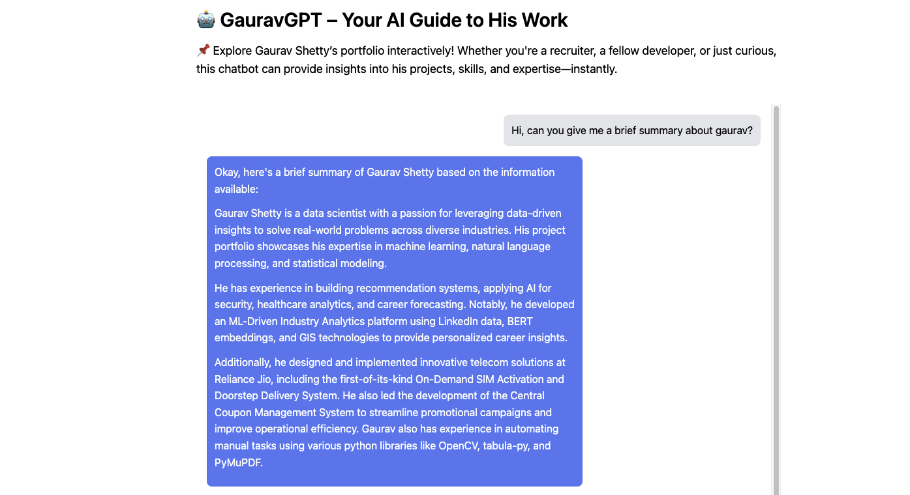

# **AI-Powered Portfolio Chatbot 🚀**  

## **📌 Overview**  
This project is an interactive chatbot integrated into my portfolio website, designed to provide dynamic responses about my work, projects, and experiences. It leverages **Retrieval-Augmented Generation (RAG)** with **FAISS** for efficient data retrieval and the **Gemini-2.0-Flash** model for response generation.  

Instead of manually navigating through my portfolio, visitors can ask questions and get precise, AI-driven answers.  

🔗 **[Try the AI-Powered Chatbot](https://gauravshetty98.github.io/portfolio/chatbot.html)**  

  

---

## **🚀 Features**  
- ✅ Uses **FAISS** for fast and scalable similarity search.  
- ✅ Converts textual data into embeddings using **all-MiniLM-L6-v2**.  
- ✅ Employs **Gemini-2.0-Flash** for intelligent response generation.  
- ✅ Built with **FastAPI** and deployed on **Render** for seamless API access.  
- ✅ Frontend implemented in **HTML, CSS, and JavaScript** for an interactive experience.  

---

## **📁 Project Structure**  

- **`app.py`** - The main script running on Render. Handles query processing, FAISS retrieval, LLM interaction, and final response generation.  
- **`portfolioContent.docx`** - Contains structured textual data about my portfolio, including projects, experiences, and publications.  
- **`requirements.txt`** - Lists all dependencies required for the project.  
- **`vectorDatabaseInit.py`** - Generates the **FAISS** vector database by embedding the textual data.  
- **`vector_database.index`** - The prebuilt FAISS database containing indexed vector embeddings for fast retrieval.  

---

## **🛠️ Technologies Used**  
- **Python** for backend logic and processing  
- **FastAPI** for building the API  
- **FAISS** for efficient similarity search  
- **SentenceTransformer (all-MiniLM-L6-v2)** for text embeddings  
- **Gemini-2.0-Flash** for AI-generated responses  
- **Render** for API deployment  
- **HTML, CSS, JavaScript** for frontend  

---

## **⚡ Setup & Usage**  

### **1️⃣ Install Dependencies**  

pip install -r requirements.txt

### **2️⃣ Initialize the FAISS Vector Database**
To prepare the database, run:

python vectorDatabaseInit.py

This will generate the FAISS index file (vector_database.index) containing the embeddings of the portfolio content.

### **3️⃣ Run the API Locally**

Start the FastAPI server using:

uvicorn app:app --host 0.0.0.0 --port 8000

Once the server is running, you can access the API documentation and test endpoints by visiting:

http://127.0.0.1:8000/docs

### **4️⃣ Interact with the Chatbot**

Use the frontend interface to input queries.
The frontend sends the query to the API, which retrieves relevant information using FAISS.
The Gemini-2.0-Flash model generates a response based on the retrieved data.
The chatbot displays the AI-generated response dynamically.

### **📢 Live Demo**
Check out the live chatbot here:
🔗 [Try it Now](https://gauravshetty98.github.io/portfolio/chatbot.html)

### **📜 License** 
This project is licensed under the MIT License – feel free to use and modify it!
